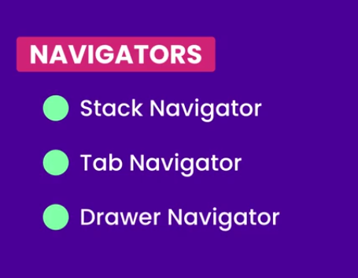
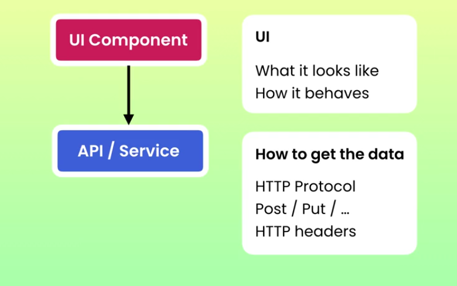
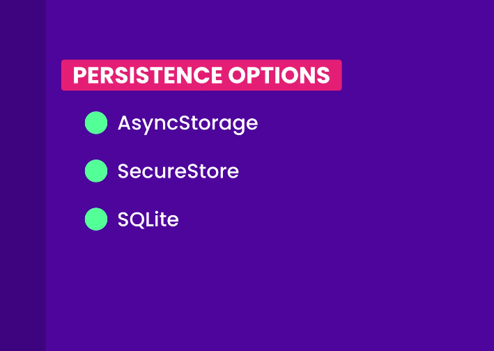
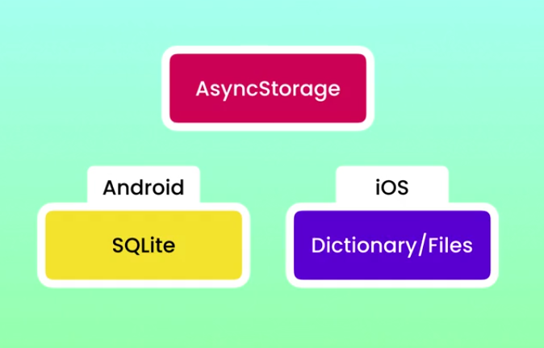
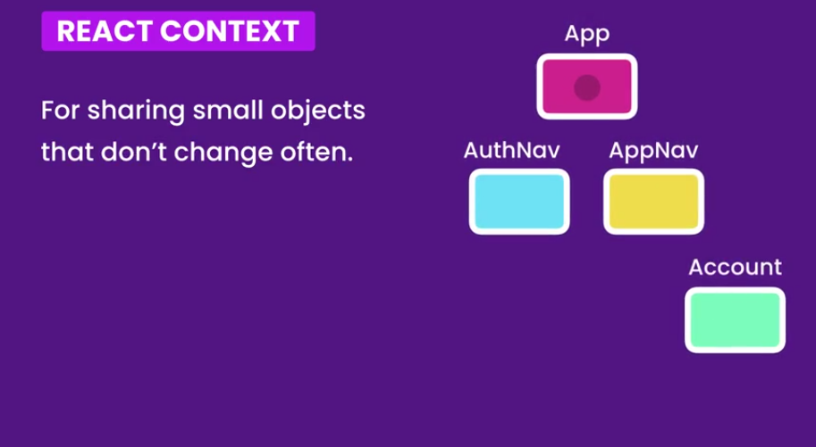
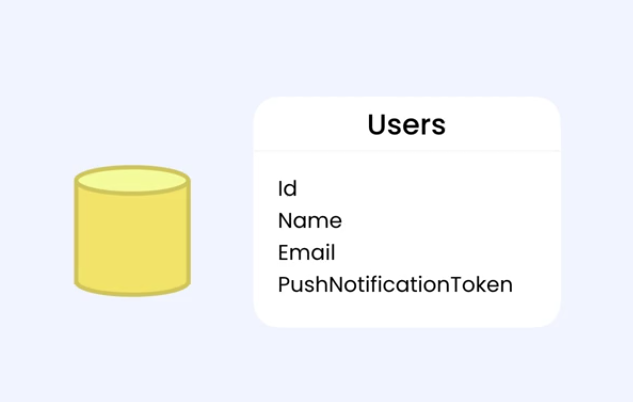

```bash
npm -i -g expo-cli
```

_Start a project_

```bash
expo init name_of_app
```

_Detect orientation_

> In app.json

```json
"orientation": "default"
```

```bash
npm install @react-native-community/hooks
```

> Form building


> ImagePicker Expo

```bash
npx expo install expo-image-picker
```

> Permissions

```bash
npx expo install expo-permissions
```

> For location

```bash
npx expo install expo-location
```

> React navigation

```bash
npm install @react-navigation/native

npx expo install react-native-screens react-native-safe-area-context
```



```bash
npm install @react-navigation/native-stack
```

> Creating Bottom tab navigator

```bash
npm install @react-navigation/bottom-tabs
```

> API

```bash
npm install apisauce
```



> _install react native debugger--> jhen0409 gtihub releases_

##### Custom Loading indicator with lottie

```bash
npx expo install lottie-react-native
```

##### Progress bar

```bash
npm install react-native-progress --save
npx expo install react-native-svg
```

##### Offline support


```bash
npx expo install @react-native-community/netinfo
```

##### Caching



> Asyncstorage



```bash
npx expo install @react-native-async-storage/async-storage
```

```js
import AsyncStorage from "@react-native-async-storage/async-storage";
```

- To handle datetime in caching we use moment
- ```
  npm i moment
  ```

##### Caching images

```npx
npx expo install react-native-expo-image-cache
```

> The library above depends on expo blur we need to install expo blur

```bash
npx expo install expo-blur
```

##### Authentication




###### JWT decode

```bash
npm jwt-decode
```

> Persisting authentication state across restarts

```bash
npx expo install expo-secure-store
```

```bash

```

##### Notifications

---




```bash
npx expo install expo-notifications
```

```bash
npx expo install expo-device
```

> _NB_ Remember you installed zoom image

#### React NAtive mapview

```bash
npx expo install react-native-maps
```
