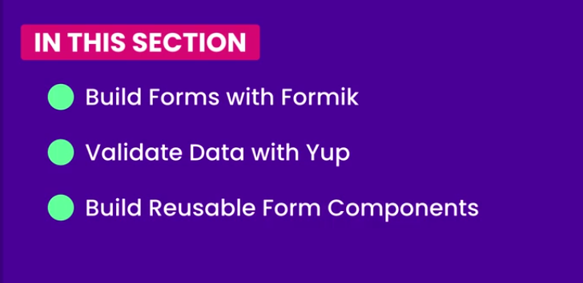

```bash
npm -i -g expo-cli
```

_Start a project_

```bash
expo init name_of_app
```

_Detect orientation_

> In app.json

```json
"orientation": "default"
```

```bash
npm install @react-native-community/hooks
```

> Form building


